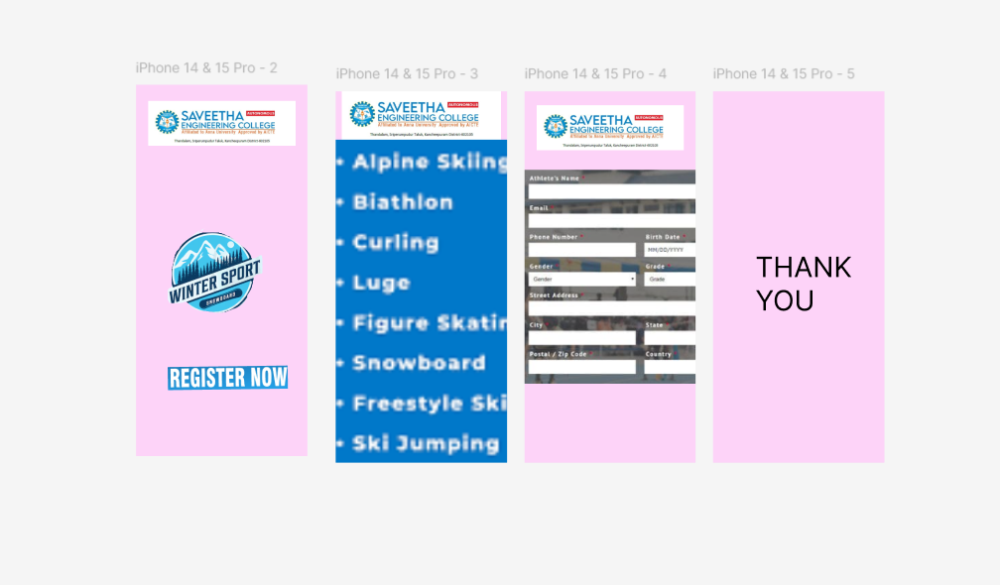

# Ex09 Event Registration Web Application
## Date:

## AIM:
To design, develop and deploy a web application for event registration.

## DESIGN STEPS:

### Step 1:
Create a new frame.

### Step 2:
Select any one preset size of your choice.

### Step 3:
Select the shapes you need.

### Step 4:
Import images as needed.

### Step 5:
Create pages based on your need and link them.

### Step 6:

Validate the HTML and CSS code.

### Step 6:

Publish the website in the given URL.

## DESIGN TOOL:
Figma

## CODE:
```
<div class="container--0-"><div class="text-0-1-0">THANK YOU</div></div>
<svg
  width="393"
  height="852"
  viewBox="0 0 393 852"
  fill="none"
  xmlns="http://www.w3.org/2000/svg"
  xmlns:xlink="http://www.w3.org/1999/xlink"
>
  <g clip-path="url(#clip0_2_5)">
    <rect width="393" height="852" fill="#FDD3F8"></rect>
    <rect y="111" width="469" height="828" fill="url(#pattern0_2_5)"></rect>
    <rect x="14" width="365" height="111" fill="url(#pattern1_2_5)"></rect>
  </g>
  <defs>
    <pattern
      id="pattern0_2_5"
      patternContentUnits="objectBoundingBox"
      width="1"
      height="1"
    >
      <use
        xlink:href="#image0_2_5"
        transform="matrix(0.00530168 0 0 0.003003 -0.00100847 0)"
      ></use>
    </pattern>
    <pattern
      id="pattern1_2_5"
      patternContentUnits="objectBoundingBox"
      width="1"
      height="1"
    >
      <use
        xlink:href="#image1_2_5"
        transform="scale(0.000632511 0.00207988)"
      ></use>
    </pattern>
    <clipPath id="clip0_2_5">
      <rect width="393" height="852" fill="white"></rect>
    </clipPath>
    <image
      id="image0_2_5"
      width="189"
      height="333"
      preserveAspectRatio="none"
      xlink:href="data:image/png;base64,CC"
    ></image>
    <image
      id="image1_2_5"
      width="1581"
      height="481"
      preserveAspectRatio="none"
      xlink:href="data:image/png;base64,E+LhISEhISEhISEhISEhISEhISEhISEhIT/6UieFgkJCQkJCQkJCQkJCQkJCQkJCQkJCQkJrwXSmRYJCQkJCQkJCQkJCQkJCQkJCQkJCQkJCa8FkqdFQkJCQkJCQkJCQkJCQkJCQkJCQkJCQsJrgf8HUPsJ/IC1KvUAAAAASUVORK5CYII="
    ></image>
  </defs></svg
><svg
  width="393"
  height="852"
  viewBox="0 0 393 852"
  fill="none"
  xmlns="http://www.w3.org/2000/svg"
  xmlns:xlink="http://www.w3.org/1999/xlink"
>
  <g clip-path="url(#clip0_2_6)">
    <rect width="393" height="852" fill="#FDD3F8"></rect>
    <rect y="180" width="529" height="491" fill="url(#pattern0_2_6)"></rect>
    <rect
      x="28"
      y="32"
      width="338"
      height="103"
      fill="url(#pattern1_2_6)"
    ></rect>
  </g>
  <defs>
    <pattern
      id="pattern0_2_6"
      patternContentUnits="objectBoundingBox"
      width="1"
      height="1"
    >
      <use
        xlink:href="#image0_2_6"
        transform="scale(0.00359754 0.00387597)"
      ></use>
    </pattern>
    <pattern
      id="pattern1_2_6"
      patternContentUnits="objectBoundingBox"
      width="1"
      height="1"
    >
      <use
        xlink:href="#image1_2_6"
        transform="matrix(0.000633542 0 0 0.002079 -0.000814993 0)"
      ></use>
    </pattern>
    <clipPath id="clip0_2_6">
      <rect width="393" height="852" fill="white"></rect>
    </clipPath>
    <image
      id="image0_2_6"
      width="278"
      height="258"
      preserveAspectRatio="none"
      xlink:href="data:image/png;base64,"
    ></image>
  </defs>
</svg>
```

## OUTPUT:


## RESULT:
The program to design, develop and deploy a web application for event registration is completed successfully.
